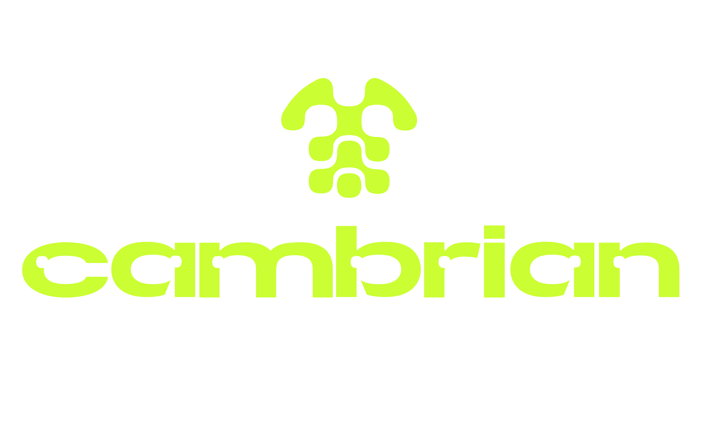

<p align="center">
  
</p>

# Cambrian SEI AI Agent

A chat interface for interacting with an AI assistant that can communicate with the Sei blockchain.

## Getting Started

### Prerequisites

- Node.js 16+
- npm

### Installation

1. Clone the repository:
   ```bash
   git clone https://github.com/yourusername/agent-launcher.git
   cd agent-launcher
   ```

2. Install dependencies:
   ```bash
   npm install
   ```

3. Create a .env file
   ```bash
   cp .env.example .env
   ```
   Modify the .env file adding your Sei wallet 0x private key, your OpenAI api key and the relevant Sei RPC (you can use the default value)


4. Start the development server:
   ```bash
   npm run dev
   ```

5. Open [http://localhost:3000](http://localhost:3000) in your browser.

## Usage

The chat interface provides a simple way to interact with the Cambrian AI Assistant. Simply type your question or request in the input field and press enter or click the send button. The AI will process your message and respond in real-time.

Example queries:
- "How can I interact with the Sei blockchain?"
- "How much sei do I own?"
- "Swap 5 sei for USDC."
- "Stake 3 sei."

## Additional Information
For more details on the available features, visit our [website](https://www.cambrian.wtf/) or the [official Sei Agent Kit repository](https://github.com/CambrianAgents/sei-agent-kit).

## Contact
Follow us on [X](https://x.com/cambrian_ai)

# Sei Agent Deployment

## Quick Deployment

### Deploy on Vercel (Recommended)

The easiest way to deploy this agent is using [Vercel](https://vercel.com):

1. Push your code to a GitHub repository
2. Go to [Vercel](https://vercel.com) and sign up or log in
3. Click "Add New Project" and import your GitHub repository
4. Configure the following environment variables:
   - `OPENAI_API_KEY`
   - `SEI_PRIVATE_KEY`
   - `RPC_URL`
5. Click "Deploy"

### Alternative: Deploy on Netlify

1. Push your code to a GitHub repository
2. Go to [Netlify](https://netlify.com) and sign up or log in
3. Click "Add new site" → "Import an existing project"
4. Connect to your GitHub repository
5. Configure the build settings:
   - Build command: `npm run build`
   - Publish directory: `.next`
6. Add the environment variables in the site settings
7. Deploy the site

## Environment Setup

Before deploying, make sure you have the following environment variables set:

```
OPENAI_API_KEY=your_openai_api_key
SEI_PRIVATE_KEY=your_sei_private_key
RPC_URL=your_rpc_url
```

## Local Development

To run the agent locally:

```bash
npm install
npm run dev
```

Visit [http://localhost:3000](http://localhost:3000) to see your agent in action.
